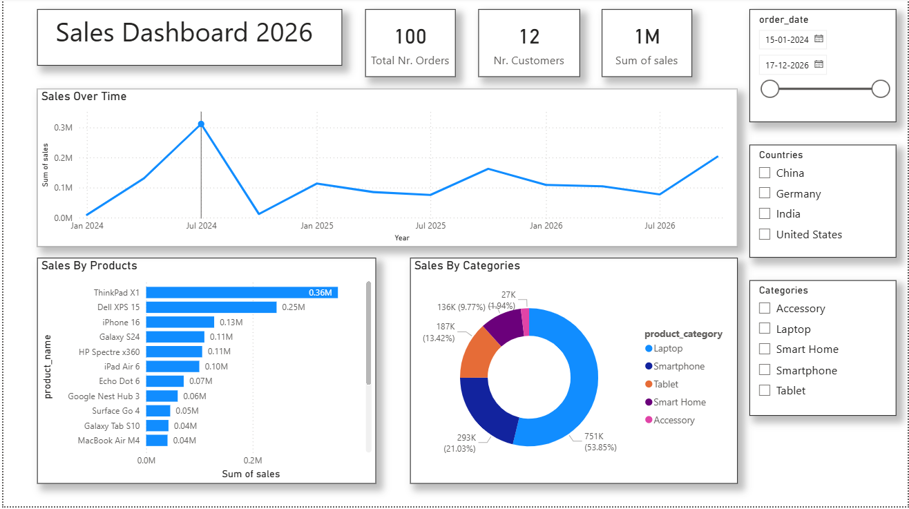

# 📊 Sales Dashboard 2026

## Project Overview

This Power BI dashboard provides an interactive analysis of sales performance across products, categories, customers, and countries. The dashboard helps identify sales trends, top-performing products, and category-wise contributions to overall revenue.

---

## 🎯 Objectives

- Monitor overall sales performance.
- Track sales trends over time.
- Identify top-selling products.
- Analyze sales distribution across product categories.
- Enable interactive filtering by country, category, and date range.

---

## 🛠 Tools Used

- Power BI
- Data Modeling
- DAX Measures
- Data Visualization

---

## 📈 Key Metrics

- Total Orders: 100
- Total Customers: 12
- Total Sales: 1M

---

## 📋 Dashboard Features

### 1. Sales Over Time
- Displays monthly sales trends from 2024 to 2026.
- Helps identify peak and low sales periods.

### 2. Sales by Products
- Highlights top-performing products based on sales.
- Enables comparison between different products.

### 3. Sales by Categories
- Visualizes category-wise sales contribution.
- Categories included:
  - Laptop
  - Smartphone
  - Tablet
  - Smart Home
  - Accessory

### 4. Interactive Filters
Users can filter the dashboard using:
- Date Range
- Country
- Product Category

Supported Countries:
- China
- Germany
- India
- United States

---

## 💡 Key Insights

- Laptops contribute the highest share of total sales.
- ThinkPad X1 is the top-selling product.
- Sales show fluctuations over time with noticeable peaks during specific periods.
- Smartphones represent the second-largest revenue-generating category.

---

## 🖼 Dashboard Preview



---

## 📂 Repository Contents

```text
Sales-Dashboard-2026/
│
├── Sales dashboard 2026.pbix
├── Dashboard_png.png
└── README.md
```

---

## 🚀 Skills Demonstrated

- Data Cleaning
- Data Modeling
- DAX Calculations
- Dashboard Design
- Business Intelligence
- Data Visualization
- Sales Analysis
- Interactive Reporting

---

## 👩‍💻 Author

**Sanjana Soundararajan**

LinkedIn Profile: [Sanjana Soundararajan](https://www.linkedin.com/in/sanjana-soundararajan-ts)

---

## ⭐ About This Project

This project demonstrates the use of Power BI to transform raw sales data into meaningful business insights through interactive visualizations and dashboards. It showcases analytical, visualization, and reporting skills relevant to Data Analytics and Business Intelligence roles.
